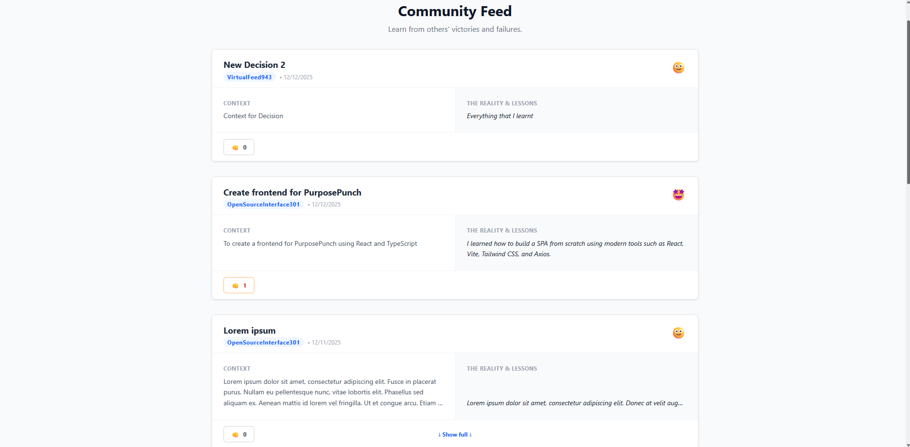
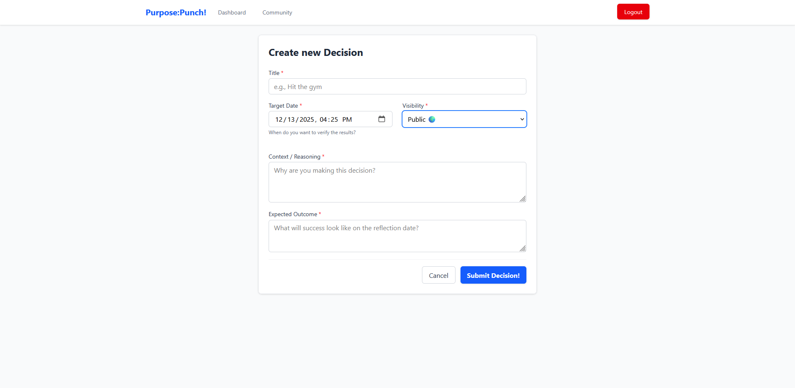

# Purpose:Punch!


**Purpose** of this app: To **punch** you for every decision you have made but never achieved. Now every such uncompleted decision will be put on public display, and you can already feel **punched** out!



<details>
<summary>More screenshots</summary>

  


</details>

## Concept

Users log significant decisions with reasoning and expectations.  
After a reflection period, users record outcomes and lessons learned.  
Users can optionally publish anonymized reflections for others to browse, learn from, or get inspired by.

## Tech Stack

- **Framework:** React (via Vite)
- **Language:** TypeScript (Strict typing for DTOs, Enums, and Props)
- **Styling:** Tailwind CSS
- **Routing:** React Router v7 (Protected & Public Routes)
- **HTTP Client:** Axios (Global interceptors for Auth & Error Handling)
- **Utilities:** clsx & tailwind-merge for intelligent style composition

## Getting Started

### Prerequisites

- Node.js (v20+)
- The [PurposePunch Backend](https://github.com/Donkrzawayan/PurposePunch-backend) configured via .env.

### Installation

```pwsh
npm install # dependencies
npm run dev
```
